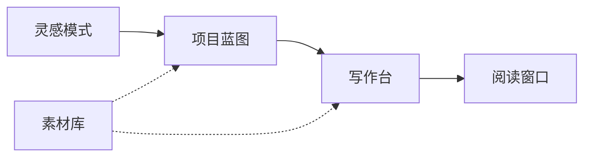

# Manong Novel

**面向小说作者的 AI 写作桌面客户端**

从灵感立项、蓝图规划到章节生成与沉浸式阅读，覆盖完整创作链路。

[English](#english) · [界面预览](docs/preview.md) · [下载](#下载) · [功能特性](#功能特性) · [快速开始](#快速开始) · [开发文档](docs/development.md)

---

## 界面预览

  

首页 — 作品概览、继续写作入口与最近动态 · <a href="docs/preview.md">查看全部界面预览 →</a>

---

## 下载

前往 [GitHub Releases](https://github.com/qq1171910065/manong-novel/releases/latest) 下载对应平台的安装包：

| 平台 | 文件 |
|------|------|
| **Windows** | `manong-novel-*-setup.exe` |
| **macOS** | `manong-novel-*.dmg` |

---

## 功能特性

| 模块 | 说明 |
|------|------|
| **书架** | 创建、导入、导出小说项目，统一管理创作资产 |
| **新手引导** | 首次登录情境式引导，用示例作品走完蓝图 → 写作 → 阅读 |
| **灵感模式** | 对话式构思，建议芯片与概念清单，生成创作方向 |
| **项目蓝图** | 结构化维护世界观、角色、关系网与章节大纲 |
| **写作台** | AI 辅助章节生成、润色、多版本切换与流式输出 |
| **素材库** | 角色库、文风库，可在多个项目间复用 |
| **阅读窗口** | 独立阅读模式，支持分页导航与 TTS 朗读 |
| **模型设置** | 在应用内选择 AI 模型并配置 API 密钥 |
| **语言** | 内置中英文界面，设置中可随时切换 |
| **账户** | 登录后可查看用量与充值 |

### 创作流程

---

## 快速开始

### 安装

1. 从 [Releases](https://github.com/qq1171910065/manong-novel/releases/latest) 下载安装包
2. **Windows**：运行 `.exe` 安装程序，按提示完成安装
3. **macOS**：打开 `.dmg`，将应用拖入「应用程序」文件夹

### 首次使用

1. 启动应用，在登录页完成账户登录
2. 可选：接受右下角 **新手引导**，用示例作品快速熟悉主流程（可随时跳过，设置中可重新体验）
3. 进入 **书架**，创建、导入或打开一个项目
4. 在 **设置 → 模型 / 密钥** 中选择 AI 模型并完成配置；需要时可在 **设置 → 语言** 切换界面语言
5. 从 **灵感模式** 或 **项目蓝图** 开始构思，再进入 **写作台** 生成章节

---

## 仓库

| 平台 | 地址 |
|------|------|
| GitHub（主仓库） | https://github.com/qq1171910065/manong-novel |
| Gitee（镜像） | https://gitee.com/czmanong/novel |

---

## 致谢

本项目基于以下开源项目演进：

- [t59688/arboris-novel](https://github.com/t59688/arboris-novel) — 小说写作业务逻辑与 UI 参考
- [qq1171910065/manong-arena](https://github.com/qq1171910065/manong-arena) — Electron 基座与 Platform 集成

---

## License

[MIT](LICENSE) © Manong Novel Contributors

---

## English

<b>Manong Novel — AI-powered desktop writing client for novelists</b>

 

**Manong Novel** is an open-source desktop app for fiction authors. It supports the full creative workflow — from inspiration and blueprint planning to AI-assisted chapter generation and immersive reading.

### Highlights

- **Bookshelf** — Create, import, and export novel projects
- **Onboarding** — Optional guided tour with a sample project after first sign-in
- **Inspiration Mode** — Conversational ideation with suggestion chips and concept lists
- **Blueprint** — World-building, characters, relationships, and chapter outlines
- **Writing Desk** — AI chapter generation, polishing, and version management
- **Material Library** — Reusable character and style libraries across projects
- **Reading Window** — Immersive reading with pagination, chapter navigation, and TTS
- **Language** — Built-in Chinese / English UI switching

### Getting Started

1. Download the installer from [Latest Release](https://github.com/qq1171910065/manong-novel/releases/latest)
2. Install and launch the app, then sign in (optional onboarding tour available)
3. Open **Bookshelf** to create, import, or open a project
4. Configure your AI model under **Settings → Models / Keys**; switch language under **Settings → Language** if needed

**Screenshots:** [Full UI preview](docs/preview.md)

**Development:** [Developer docs](docs/development.md)

**License:** [MIT](LICENSE)

