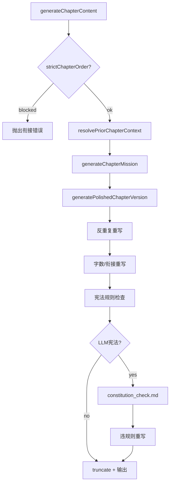

# 小说写作连贯性工程 — 设计说明

> 2026-07-05 · 解决「前言不搭后语」、章节衔接与全局资产注意力  
> **状态：已全部完成**

## 问题诊断

写作 pipeline 在概念/蓝图阶段信息丰富，但章节正文生成曾只传 synopsis + 当前章纲 + 上一章 600 字，与 `writing_v2.md` 承诺的输入不一致，导致长篇人设漂移、伏笔遗忘、章节断层。

## 已实现能力

### 1. 章节写作上下文 (`chapter-writing-context.ts`)

| 能力 | 说明 |
|------|------|
| `resolvePriorChapterContext` | 严格 N-1 衔接，跳章/未确认摘要警告 |
| `buildTrimmedBlueprintSnapshot` | 裁剪蓝图：已登场 + 本章相关角色/地点/势力 |
| `buildRollingRecapSummaries` | 最近 3 章滚动前情 |
| `buildForeshadowingWritingHints` | 大纲【埋】【收】+ analytics 正文伏笔 |
| `buildForbiddenCharacterNames` | 未登场禁止点名名单 |
| `assertChapterGenerationAllowed` | 严格顺序：上一章须 `successful` |
| `ChapterMission` | 导演脚本 + LLM 解析 + 规则兜底 |

### 2. 伏笔追踪 (`foreshadowing-tracker.ts`)

- 从章节正文 regex 提取伏笔（与分析页共用）
- `buildAnalyticsForeshadowingHints` 注入写作：逾期 / 临近回收 / 长期活跃

### 3. 宪法合规 (`chapter-constitution-check.ts`)

- **规则检查**：禁止角色、全知旁白、章末套话、AI 套话
- **LLM 深度检查**（可选）：`constitution_check.md`，违规时自动重写
- Pipeline 步骤：`chapter_constitution`

### 4. 两阶段章节生成

```
assertChapterGenerationAllowed
  → generateChapterMission (chapter_plan.md)
  → generatePolishedChapterVersion (writing_v2.md)
       → 章节内重复重写
       → 字数/衔接重写 (buildChapterRewriteHint)
       → 宪法合规重写 (runConstitutionGateAndRewrite)
```

### 5. Prompt 注册表 (`prompt-registry.ts`)

- 27 个模板标记 `wired` / `unwired` / `deprecated`
- 创作流水线面板展示接入统计

### 6. 创作流程设置

| 选项 | 默认 | 作用 |
|------|------|------|
| `strictChapterOrder` | 开 | 上一章确认后才可写下一章 |
| `enableConstitutionLlmCheck` | 开 | 规则后追加 LLM 宪法分析 |
| `autoWritePauseBeforeConfirm` | 关 | AI 接管每章暂停确认 |
| `autoWriteMultiVersion` | 关 | 多版本 + 评审 |

## 验证

- `pnpm test` — 单元测试覆盖 context / constitution / foreshadowing
- `pnpm typecheck` — 类型检查

## 架构图


